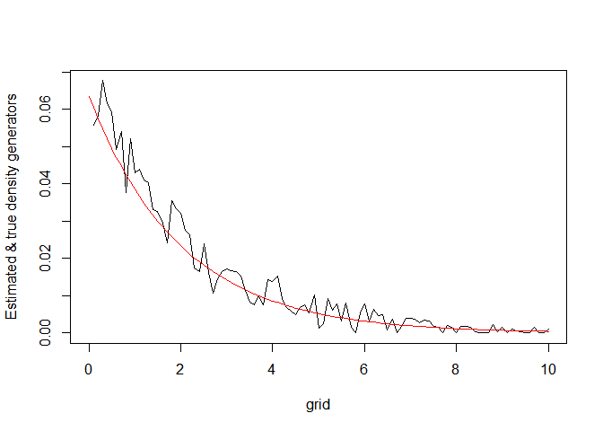

<!-- README.md is generated from README.Rmd. Please edit that file -->

# Package ElliptCopulas

This package implements several functions for the estimation of
meta-elliptical copulas and for the estimation of elliptical and
trans-elliptical distributions:

- *elliptical distributions* are distributions for which the isodensity
  surfaces/curves are ellipses. Their distribution is determined by a
  mean, a variance matrix and a univariate function called the
  generator.

- *(meta-)elliptical copulas* are copulas defined implicitly as copula
  functions of elliptical distributions. Their distribution is
  determined by a correlation matrix and a generator.

- *trans-elliptical distributions* are distributions whose copula is
  meta-elliptical and whose margins are arbitrary. In other words, a
  trans-elliptical distribution is a multivariate distribution built
  from the dependence structure (copula) of an elliptical distribution,
  but which could have any margin. Their distribution is therefore
  determined by the marginal distributions, the correlation matrix and
  the generator.

# How to install

The release version on CRAN:

``` r
install.packages("ElliptCopulas")
```

The development version from GitHub:

``` r
# install.packages("remotes")
remotes::install_github("AlexisDerumigny/ElliptCopulas")
```

# Main functions of the package

## 1. Inference of Elliptical Distributions

- `EllDistrSim`: simulate data from an elliptical distribution with a
  given arbitrary generator.

``` r
# Sample from an Elliptical distribution for which the
# squared radius follows an exponential distribution
mu = c(2,6,-5)
cov1 = rbind(c(1  , 0.3, 0.3),
             c(0.3, 1  , 0.3),
             c(0.3, 0.3, 1  ))
# cov1 = diag(3)
grid = seq(0,10, by = 0.1)
generator = exp(- grid/2) / (2*pi)^(3/2)
density_R2 = Convert_gd_To_fR2(grid = grid, g_d = generator, d = 3)
X = EllDistrSim(n = 1000, d = 3, A = chol(cov1), mu = mu,
                density_R2 = density_R2)
plot(X[, 1], X[, 2])
```


- `EllDistrEst`: nonparametric estimation of the generator of an
  elliptical distribution.

``` r
estDensityGenerator = EllDistrEst(X = X, mu = mu, Sigma_m1 = solve(cov1),
                                  grid = grid, a = 10, h = 0.02, dopb = FALSE)

plot(grid, estDensityGenerator, type = "l", ylab = "Estimated & true density generators")
lines(grid, generator, col = "red")
```



## 2. Estimation of correlation matrix

- `KTMatrixEst`: fast estimation of Kendall’s tau correlation matrix
  assuming that it has a block structure. This procedure works even if
  the distribution is not elliptical.

However, in the elliptical case, it can be used to recover the (usual)
Pearson’s correlation matrix for elliptical distribution, as both are
then linked by the relationship $\tau = 2 Arcsin(\rho) / \pi$.

``` r
matrixCor = matrix(c(1  , 0.5, 0.3 ,0.3,
                     0.5,   1, 0.3, 0.3,
                     0.3, 0.3,   1, 0.5,
                     0.3, 0.3, 0.5,   1), ncol = 4 , nrow = 4)
dataMatrix = mvtnorm::rmvnorm(n = 100, mean = rep(0, times = 4), sigma = matrixCor)
blockStructure = list(1:2, 3:4)
estKTMatrix = KTMatrixEst(dataMatrix = dataMatrix, blockStructure = blockStructure,
                           averaging = "all")
InterBlockCor = sin(estKTMatrix[1,2] * pi / 2)

# Estimation of the correlation between variables of the first group
# and of the second group
print(InterBlockCor) 
#> [1] 0.2698366
# to be compared with the true value: 0.3.
```

## 3. Inference of (Meta-)Elliptical Copulas

- `EllCopEst`: nonparametric estimation of the generator of an
  elliptical copula.

- `EllCopSim`: simulate data from an elliptical copula with a given
  arbitrary generator.

- `EllCopLikelihood`: compute the likelihood of a given elliptical
  copula generator.

## 4. Inference of Trans-Elliptical Distributions

- `TEllDistrEst`: estimation of the marginal cdfs, estimation of the
  correlation matrix by inversion of Kendall’s tau and nonparametric
  estimation of the generator.

## 5. Numerical analysis

- `DensityGenerator.normalize`: normalize an elliptical copula density
  generator in order to satisfy the identifiability constraints.

- `DensityGenerator.check`: check whether a given density generator is
  normalized.

- `Convert_gd_To_g1`, `Convert_g1_To_Fg1`, `Convert_g1_To_Qg1`,
  `Convert_g1_To_f1`, `Convert_gd_To_fR2`: convert between

  - a d-dimensional generator gd
  - the 1-dimensional version g1
  - the density f1 of a 1 dimensional margin
  - the cdf Fg1 of a 1-dimensional margin
  - the quantile function Qg1 of a 1-dimensional margin
  - the density fR2 of the random variable R^2, where X = RV, with R the
    modular variable of X, V uniform on the d-dimensional unit sphere,
    and X is an elliptically distributed random vector.

# References

Derumigny, A., & Fermanian, J. D. (2022). Identifiability and estimation
of meta-elliptical copula generators. Journal of Multivariate Analysis,
article 104962.
[doi:10.1016/j.jmva.2022.104962](https://doi.org/doi:10.1016/j.jmva.2022.104962),
[arXiv:2106.12367](https://arxiv.org/pdf/2106.12367.pdf).

Liebscher, E. (2005). A semiparametric density estimator based on
elliptical distributions. Journal of Multivariate Analysis, 92, 205–225.
[doi:10.1016/j.jmva.2003.09.007](https://doi.org/10.1016/j.jmva.2003.09.007)

van der Spek, R., & Derumigny, A. (2022). Fast estimation of Kendall’s
Tau and conditional Kendall’s Tau matrices under structural assumptions.
[arXiv:2204.03285](https://arxiv.org/pdf/2204.03285.pdf).
